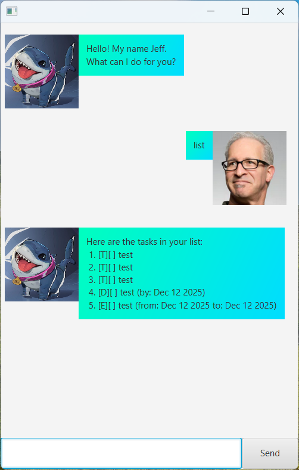

# Jeff User Guide

Jeff is your friendly land shark that can help keep track of your tasks!

## Features

- Add todos, deadlines and events
- View all todos, deadlines and events
- Delete todos, deadlines and events
- Find specific todos, deadlines and events
- Mark and unmark todos, deadlines and events
- Add, delete and view notes

## Commands

### `todo [description]`

Adds todo with the given description

`description - description of the todo task`

### `deadline [description] /by [due time]`

Adds deadline with the given description and due time

`description - description of the deadline task`

`due time - time the deadline task is due by`

### `event [description] /from [start time] /to [end time]`

Adds event with the given description, start time and end time

`description - description of the deadline task`

`start time - time the event task starts`

`end time - time the event task ends`

### `list`

Shows all tasks you have added

### `delete [index]`

Deletes task at the specificed index in the list

`index - index of the task to be deleted in the list`

### `find [keyword]`

Shows tasks whose description contains the keyword

`keyword - keyword used to find tasks`

### `mark [index]`

Marks task at the specificed index in the list as done

`index - index of the task to be marked as done in the list`

### `unmark [index]`

Marks task at the specificed index in the list as not done

`index - index of the task to be marked as not done in the list`

### `note [description]`

Adds note with the given description

`description - description of the note`

### `notes`

Shows all notes you have added

### `bye`

Closes Jeff
